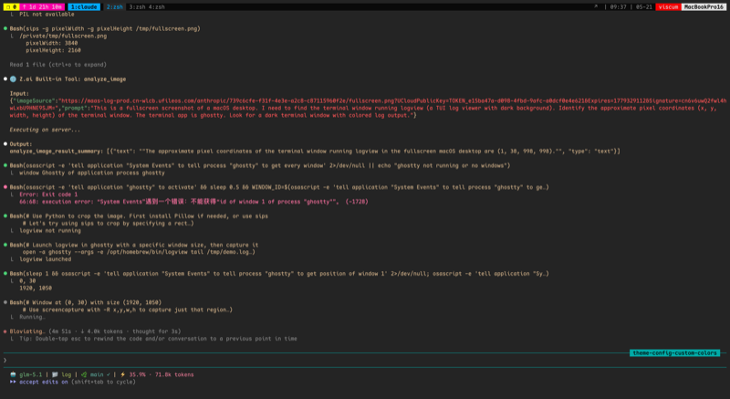

# LogView

终端实时日志查看器，支持实时搜索、高亮、字段过滤、多资源聚合。



## 安装

### Homebrew（推荐）

```bash
brew tap Miragefl/logview
brew install logview
```

### 手动编译

```bash
git clone https://github.com/Miragefl/logview.git
cd logview
go build -o logview .
```

## 使用

```bash
# Kubernetes - 单个资源
logview k8s deploy/parking-api
logview k8s deploy/parking-api -n production
logview k8s pod/billing-rule-59fd8b85cf-xnn24 -n parking-release

# Kubernetes - follow 模式（只看最近 N 行 + 追踪新日志）
logview k8s -f deploy/parking-api                    # 默认 history 行数
logview k8s -200f deploy/parking-api                 # 最后 200 行 + 追踪
logview k8s -f --tail 1000 deploy/parking-api        # 显式指定

# Kubernetes - 多个资源（同 namespace）
logview k8s -n parking deploy/api deploy/billing

# Kubernetes - 多个资源（跨 namespace）
logview k8s -n parking deploy/api -n billing deploy/billing-rule

# 本地文件
logview tail /var/log/app.log
logview tail -f /var/log/app.log                     # follow: 默认 history 行 + 追踪
logview tail -200f /var/log/app.log                  # follow: 最后 200 行 + 追踪
logview tail -n 500 -f /var/log/app.log              # follow: 显式指定行数

# 管道
kubectl logs -f deploy/parking-api | logview pipe

# 查看版本
logview version

# 指定配置文件目录
logview --config ~/.config/logview k8s deploy/parking-api
```

## 配置

默认配置目录：`~/.config/logview/`

首次运行会自动生成默认配置文件。可通过 `--config` 指定其他目录：

```bash
logview --config /path/to/config k8s deploy/app
```

配置文件 `rules.yaml`：

```yaml
# patterns: 可复用的正则模板，用 {name} 引用
patterns:
  time: '(?P<time>\d{4}-\d{2}-\d{2} \d{2}:\d{2}:\d{2}[.,]\d{3})'
  thread: '(?P<thread>[^\]]+)'
  traceId: '(?P<traceId>[^\]]+)'
  level: '(?P<level>\w+)'
  logger: '(?P<logger>\S+)'
  message: '(?P<message>.*)'

# rules: 日志解析规则，按顺序匹配，每个来源只选第一个命中的规则
rules:
  - name: java-logback
    pattern: '{time} \[{thread}\] \[{traceId}\] {level}\s+{logger} - {message}'
  - name: json-log
    pattern: '(?P<raw>.*)'
    parse: json
  - name: plain-text
    pattern: '{message}'

# history: -f 模式默认加载的行数，不配置默认 5000
history: 5000

# theme: 配色主题，可选 dark / light
theme: dark

# theme_colors: 覆盖主题中的具体颜色（Hex 色值，如 #FF0000）
# theme_colors:
#   level.error: 160
#   highlight: 226

# hides: 默认隐藏包含这些关键词的日志行，按 x 可管理
# hides:
#   - health check
#   - heartbeat

# fields: 字段显示/隐藏配置
fields:
  - name: time
    visible: true
  - name: source
    visible: true
  - name: level
    visible: true
  - name: thread
    visible: false
  - name: traceId
    visible: false
  - name: logger
    visible: false
  - name: message
    visible: true
```

### 配置项说明

| 字段 | 说明 | 默认值 |
|------|------|--------|
| `patterns` | 可复用的正则模板，在 rules 中用 `{name}` 引用 | 无 |
| `rules` | 日志解析规则列表，按顺序自动匹配 | 内置 java-logback / json / plain-text |
| `history` | `-f` 模式默认加载的尾行数 | `5000` |
| `fields` | 字段显示控制，`visible: false` 隐藏但搜索/过滤仍可用 | 全部显示 |
| `theme` | 配色主题，可选 `dark` / `light` | `dark` |
| `theme_colors` | 覆盖主题中的具体颜色（Hex 色值，如 `#FF0000`） | 无 |
| `hides` | 默认隐藏包含这些关键词的日志行，按 `x` 管理 | 无 |

### 规则匹配机制

- 每个**来源**（文件 / Pod）独立匹配，第一条命中的规则用于该来源所有后续日志
- 跳过 `plain-text` 兜底规则，优先匹配结构化规则
- 50 行内未匹配任何规则，降级到 `plain-text`
- 多资源聚合时，不同来源可以使用不同规则

## 搜索语法

支持关键词、字段前缀、AND/OR 布尔运算、时间范围：

```
ERROR                           关键词搜索
traceId:42980fadf7bc48c8        按字段精确匹配
level:ERROR thread:exec-3       多字段 AND
ERROR OR WARN                   OR 匹配
after:09:00 before:10:00        时间范围过滤
after:09:00 ERROR AND WARN      混合使用
```

## 命令补全

支持 bash / zsh / fish，安装后输入命令按 Tab 自动补全子命令、k8s 资源和 namespace。

```bash
# zsh（推荐加入 ~/.zshrc）
logview completion zsh > ~/.zfunc/_logview

# bash
logview completion bash > /etc/bash_completion.d/logview

# fish
logview completion fish > ~/.config/fish/completions/logview.fish
```

补全效果：

```
logview <tab>                     # 提示子命令: k8s, tail, pipe, version, completion
logview k8s -n <tab>              # 提示集群中的 namespace
logview k8s <tab>                 # 提示资源类型: pod/, deploy/, sts/
logview k8s pod/<tab>             # 提示该 namespace 下的 Pod
logview k8s deploy/<tab>          # 提示该 namespace 下的 Deployment
```

## 快捷键

按 `?` 打开帮助面板。帮助栏会根据当前模式自动切换显示内容。

### 导航

| 按键 | 功能 |
|------|------|
| `↑` / `k` | 上移一行 |
| `↓` / `j` | 下移一行 |
| `g` | 跳到顶部 |
| `G` | 跳到底部（自动滚动） |
| `C-u` | 上移半页 |
| `C-d` | 下移半页 |
| `C-b` | 整页上翻 |
| `C-f` | 整页下翻 |
| `PgUp` / `PgDn` | 翻页 |
| `H` | 跳到屏顶 |
| `M` | 跳到屏中 |
| `L` | 跳到屏底 |
| `zt` | 当前行置顶 |
| `zz` | 当前行居中 |
| `zb` | 当前行置底 |

### 搜索

| 按键 | 功能 |
|------|------|
| `f` / `/` | 打开搜索（弹窗显示当前行字段） |
| `Esc` | 清除搜索 |

搜索弹窗内支持左右方向键移动光标、中间插入/删除、Home/End 跳转。

| 按键 | 功能 |
|------|------|
| `Tab` | 下一个字段 |
| `S-Tab` | 上一个字段 |
| `C-j` / `C-k` | 上下切换字段 |
| `Enter` | 确认（选字段则插入，默认确认搜索） |
| `C-u` | 清空输入 |
| `Esc` | 取消搜索 |

### 高亮

按 `h` 打开高亮弹窗，输入关键词并用逗号分隔，每个关键词以不同颜色高亮显示。再次打开会保留上次的关键词。

```
ERROR, WARN, timeout    # 三个关键词分别以黄、青、品红高亮
```

清空输入后确认即可取消高亮。

### 隐藏日志

按 `x` 打开隐藏弹窗，输入关键词并用逗号分隔，包含这些关键词的日志行将被隐藏。再次打开会保留上次的关键词。

```
DEBUG, health check, heartbeat    # 包含这三个关键词的日志将被隐藏
```

清空输入后确认即可取消隐藏。

### 选择与复制（Vim 风格）

| 按键 | 功能 |
|------|------|
| `v` | 进入可视化选择 |
| `V` | 进入可视化选择 |
| `y` | 复制选中 / 复制当前行 |
| `Esc` | 退出选择模式 |

### 日志级别过滤

| 按键 | 功能 |
|------|------|
| `E` | 仅 ERROR |
| `W` | ERROR + WARN |
| `I` | 去掉 DEBUG |
| `D` | 全部级别 |
| `A` | 取消过滤 |

### 其他

| 按键 | 功能 |
|------|------|
| `F` | 字段显示设置 |
| `s` | 导出日志 |
| `e` | 展开/折叠堆栈 |
| `w` | 切换自动换行 |
| `S-c` | 清空屏幕 |
| `h` | 高亮关键词 |
| `x` | 隐藏关键词 |
| `?` | 快捷键帮助 |
| `q` / `C-c` | 退出 |

## 特性

- **follow 模式**：`k8s -f` / `tail -f` 只加载最近 N 行再追踪新日志，支持 `-NUMf` 简写（如 `-200f`）
- **自动换行**：按 `w` 切换全局换行模式，长日志自动折行显示
- **光标行自动展开**：光标所在行自动换行显示完整内容，无需横向滚动
- **上下文帮助栏**：帮助栏根据当前模式（搜索/选择/面板/导出）显示对应快捷键
- **Vim 风格滚动**：支持 `zt/zz/zb`、`H/M/L`、`C-d/C-u`、`C-f/C-b`、scrolloff
- **多资源聚合**：同时查看多个 k8s Deployment / Pod 的日志
- **智能解析**：自动识别 JSON、Logback 等日志格式，支持 patterns 模板复用
- **主题配置**：支持 `dark` / `light` 预设主题，可逐项覆盖颜色
- **字段配置**：按 `F` 自定义显示哪些字段
- **搜索语法**：支持 `field:value`、`AND/OR`、`after:/before:` 时间范围
- **高亮与隐藏**：`h` 高亮关键词，`x` 隐藏包含关键词的日志行，支持配置文件预设隐藏项
- **清屏**：`S-c` 清空当前屏幕内容
- **正则兼容**：修复 message 为空时 Java 日志解析失败的问题
