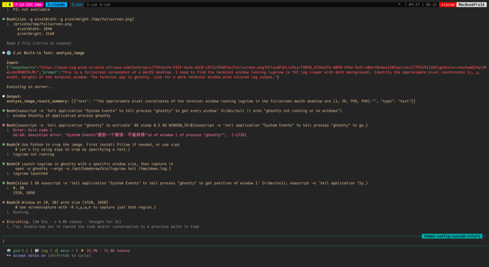

# LogView

终端实时日志查看器，支持实时搜索、高亮、字段过滤、多资源聚合。



---

## 安装

### Homebrew（推荐）

```bash
brew tap Miragefl/logview
brew install logview
```

### Linux

```bash
# x86_64 — 下载预编译二进制
curl -sL https://github.com/Miragefl/logview/releases/latest/download/logview_linux_amd64.tar.gz | tar xz
sudo mv logview /usr/local/bin/

# ARM64
curl -sL https://github.com/Miragefl/logview/releases/latest/download/logview_linux_arm64.tar.gz | tar xz
sudo mv logview /usr/local/bin/
```

### 国内镜像（Gitee）

GitHub 访问较慢时，从 Gitee 镜像下载（[查看最新版本](https://gitee.com/Mtok/logview/releases)）：

```bash
# x86_64
curl -L -o logview.tar.gz https://gitee.com/Mtok/logview/releases/download/v0.14.3/logview_linux_amd64.tar.gz
tar xzf logview.tar.gz && rm logview.tar.gz
sudo mv logview /usr/local/bin/

# ARM64
curl -L -o logview.tar.gz https://gitee.com/Mtok/logview/releases/download/v0.14.3/logview_linux_arm64.tar.gz
tar xzf logview.tar.gz && rm logview.tar.gz
sudo mv logview /usr/local/bin/

# 或从源码编译（需要 Go >= 1.21）
git clone https://gitee.com/Mtok/logview.git
cd logview && go build -o logview . && sudo mv logview /usr/local/bin/
```

### 从源码编译

```bash
git clone https://github.com/Miragefl/logview.git
cd logview && go build -o logview .
```

---

## 快速开始

```bash
# Kubernetes
logview k8s deploy/app                      # 查看日志
logview k8s -f deploy/app                   # follow 模式
logview k8s -200f deploy/app                # 最后 200 行 + 追踪
logview k8s -n prod deploy/app              # 指定 namespace
logview k8s -c uat-context deploy/app       # 指定 context（不改全局 kubeconfig）
logview k8s -n a deploy/api -n b deploy/bk  # 跨 namespace 多资源

# 本地文件
logview tail -f /var/log/app.log            # follow 模式
logview tail -200f /var/log/app.log         # 最后 200 行 + 追踪
logview file /var/log/app.log               # 只读模式
logview file app1.log app2.log              # 多文件只读

# 恢复会话
logview tail -R -f /var/log/app.log         # 恢复搜索、过滤、光标位置

# 管道
kubectl logs -f deploy/app | logview pipe
echo "hello" | logview                      # 自动检测 stdin

# 远程服务器日志（SSH + pipe，搜索/高亮/过滤全可用）
ssh user@server "tail -f /var/log/app.log" | logview        # follow 远程日志
ssh user@server "cat /var/log/app.log" | logview            # 只读整个远程文件
ssh user@server "tail -200f /var/log/app.log" | logview     # 最后 200 行 + 追踪

# 其他
logview version                             # 版本信息
logview --config /path/to/config ...        # 指定配置目录
```

---

## 快捷键

按 `?` 查看内置帮助面板。

### 导航

| 按键 | 功能 | | 按键 | 功能 |
|------|------|-|------|------|
| `↑` / `k` | 上移 | | `↓` / `j` | 下移 |
| `g` | 顶部 | | `G` | 底部 |
| `C-u` | 上半页 | | `C-d` | 下半页 |
| `C-b` | 上翻页 | | `C-f` | 下翻页 |
| `H` | 屏顶 | | `M` | 屏中 |
| `L` | 屏底 | | `zt` | 当前行置顶 |
| `zz` | 当前行居中 | | `zb` | 当前行置底 |

### 搜索

| 按键 | 功能 |
|------|------|
| `f` / `/` | 打开搜索（弹窗显示当前行字段） |
| `n` / `N` | 下一个 / 上一个匹配 |
| `C-r` | 搜索/高亮/隐藏框内打开对应历史列表 |
| `Esc` | 清除搜索 |

### 切换日志源

TUI 内按 `o` 或 `q` 打开源选择器，不退出即可切换日志源（切换后清屏）。选择器内再按 `q` 退出 logview（过滤输入时 `q` 作为字符，用 `C-c` 退出）：

| Tab | 浏览层级 | 操作 |
|-----|---------|------|
| `K8s` | context → namespace → 资源 | Enter 下钻/切换 context（全局生效），`Space` 勾选多个 deploy/pod，`C-j`/`C-k` 或方向键移动，`Backspace` 逐级返回 |
| `本地` | 目录浏览器 | 目录列表（`/` 后缀）+ 日志文件，Enter 进目录/打开，`Backspace` 返回上级，也可直接输入路径 |
| `SSH` | 主机 → 远程目录 | 主机候选（`ssh_hosts` + `~/.ssh/config`），Enter 连接浏览远程目录，Enter 选文件 `tail -F` |

SSH 认证完全复用系统 `ssh`（密钥/agent/跳板/别名均可用）；主机不可达时错误以 ERROR 行显示在日志区。裸 `logview`（无子命令）在终端中直接打开选择器。

**SSH 密码认证**：需要密码的主机连接失败时自动弹出密码输入框（掩码显示），Enter 自动重连；密码仅存内存（会话内同主机免重输，不落盘）。目录浏览和 tail 均支持。

**目录过滤**：本地/SSH 目录浏览时输入即过滤（输入 `.` 开头显示隐藏文件）；输入绝对路径 + Enter 直达该目录/文件（本地）或远程目录（SSH）。

搜索弹窗内：

| 按键 | 功能 |
|------|------|
| `Tab` / `S-Tab` | 下一个 / 上一个字段 |
| `C-j` / `C-k` | 上下切换字段 |
| `Enter` | 确认 |
| `C-u` | 清空输入 |

### 过滤与高亮

| 按键 | 功能 |
|------|------|
| `E` | 仅 ERROR |
| `W` | ERROR + WARN |
| `I` | 去掉 DEBUG |
| `D` | 全部级别 |
| `A` | 取消级别过滤 |
| `h` | 高亮关键词（逗号分隔，多色显示） |
| `x` | 隐藏关键词（逗号分隔） |

### 标记与工具

| 按键 | 功能 |
|------|------|
| `m` | 标记 / 取消标记当前行 |
| `'` | 跳转到下一个标记行 |
| `#` | 切换行号显示 |
| `S` | 统计面板（各级别数量和占比） |
| `F` | 字段显示设置 |
| `s` | 导出日志 |
| `e` | 展开 / 折叠堆栈 |
| `w` | 切换自动换行 |
| `o` / `q` | 打开源选择器（K8s/本地/SSH） |
| `\` | 收起 / 展开底部快捷键提示栏 |
| `S-c` | 清空屏幕 |

### 选择与复制

| 按键 | 功能 |
|------|------|
| `v` / `V` | 进入可视化选择 |
| `y` | 复制选中内容 / 当前行 |
| `Esc` | 退出选择模式 |

---

## 搜索语法

支持关键词、字段匹配、布尔运算（`AND`/`OR`/`NOT`，大小写不敏感）、括号分组、引号、时间范围。**裸关键词只在 `message` 字段搜索**，其它字段用 `field:value` 显式指定。

```
JF350                            裸关键词（只在 message 搜索）
level:ERROR                      level 字段精确匹配
traceId:abc123 thread:exec-3     多字段 AND（相邻词默认 AND）
ERROR OR WARN                    OR 匹配
(ERROR OR WARN) AND timeout      括号分组
message:"hello world"            引号匹配含空格的值
level:ERROR NOT timeout          NOT 排除（level=ERROR 且 message 不含 timeout）
after:09:00 before:10:00         时间范围过滤
```

字段：`message` `source` `traceId` `thread` `logger`（包含匹配）、`level`（精确匹配）、`after`/`before`（时间 `HH:MM`）。

搜索后搜索栏显示匹配位置和总数（如 `[3/15匹配]`）。`n` / `N` 跳转匹配结果，对高亮关键词同样有效。

---

## 配置

配置目录：`~/.config/logview/`，首次运行自动生成。修改后自动热重载，无需重启。

### rules.yaml 完整示例

```yaml
# patterns: 可复用的正则片段，在 rules 中用 {name} 引用
patterns:
  time: '(?P<time>\d{4}-\d{2}-\d{2} \d{2}:\d{2}:\d{2}[.,]\d{3})'
  thread: '(?P<thread>[^\]]+)'
  traceId: '(?P<traceId>[^\]]+)'
  level: '(?P<level>\w+)'
  logger: '(?P<logger>\S+)'
  message: '(?P<message>.*)'

# rules: 解析规则，按顺序匹配，每个来源只选第一个命中的
rules:
  - name: java-logback
    pattern: '{time} \[{thread}\] \[{traceId}\] {level}\s+{logger} - {message}'
  - name: json-log
    pattern: '(?P<raw>.*)'
    parse: json
  - name: plain-text
    pattern: '{message}'

# history: -f 模式默认加载的尾行数
history: 5000

# theme: 配色主题（dark 系: dark/dracula/tokyo-storm/nord/gruvbox/catppuccin/one-dark
#                  light系: light/gruvbox-light/catppuccin-latte/nord-light/tokyo-day/solarized-light）
theme: dark

# theme_colors: 覆盖主题颜色（十六进制）
# theme_colors:
#   level.error: "#FF0000"
#   highlight: "#FFFF00"

# hides: 默认隐藏包含这些关键词的日志行
# hides:
#   - health check
#   - heartbeat

# fields: 字段显示/隐藏
fields:
  - name: time
    visible: true
  - name: source
    visible: true
  - name: level
    visible: true
  - name: thread
    visible: false
  - name: traceId
    visible: false
  - name: logger
    visible: false
  - name: message
    visible: true

# keybindings: 自定义快捷键（可选）
# keybindings:
#   search: "/"
#   search-next: "n"
#   search-prev: "N"
#   bookmark: "m"
#   bookmark-jump: "'"
#   line-numbers: "#"
#   stats-panel: "S"
#   quit: "q"
```

### 配置项说明

| 字段 | 说明 | 默认值 |
|------|------|--------|
| `patterns` | 可复用正则片段，rules 中用 `{name}` 引用 | 无 |
| `rules` | 解析规则列表，按顺序匹配 | 内置 java-logback / json / plain-text |
| `history` | `-f` 模式默认尾行数 | `5000` |
| `theme` | 配色主题，13 个内置（见下表） | `dark` |
| `theme_colors` | 覆盖主题颜色（十六进制） | 无 |
| `fields` | 字段显示控制，隐藏后搜索仍可用 | 全部显示 |
| `hides` | 默认隐藏关键词 | 无 |
| `keybindings` | 自定义快捷键 | 见快捷键表 |
| `ssh_hosts` | 源选择器 SSH tab 常用主机候选（与 ~/.ssh/config 合并） | 无 |

### 内置主题

配色取自各主题官方 palette（iTerm2-Color-Schemes），`theme: <名称>` 直接生效，可再用 `theme_colors` 微调。

| 主题 | 风格 | 主题 | 风格 |
|------|------|------|------|
| `dark` | 默认深色 | `light` | 默认浅色 |
| `dracula` | Dracula 紫 | `gruvbox-light` | Gruvbox 暖浅 |
| `tokyo-storm` | Tokyo Night 蓝紫 | `catppuccin-latte` | Catppuccin 柔浅 |
| `nord` | Nord 冷灰蓝 | `nord-light` | Nord 冷浅 |
| `gruvbox` | Gruvbox 暖深 | `tokyo-day` | Tokyo Day 蓝浅 |
| `catppuccin` | Catppuccin Mocha | `solarized-light` | Solarized 经典浅 |
| `one-dark` | Atom One Dark | | |

### 规则匹配机制

- 每个**来源**独立匹配，第一条命中即锁定
- 优先匹配结构化规则，跳过 `plain-text` 兜底
- 50 行内未命中任何结构化规则，降级到 `plain-text`
- 多资源聚合时，不同来源可使用不同规则

---

## 命令补全

支持 bash / zsh / fish，Tab 自动补全子命令、k8s 资源和 namespace：

```bash
# zsh
logview completion zsh > ~/.zfunc/_logview

# bash
logview completion bash > /etc/bash_completion.d/logview

# fish
logview completion fish > ~/.config/fish/completions/logview.fish
```

```
logview <tab>              # 子命令: k8s, tail, file, pipe, version, completion
logview k8s -n <tab>       # namespace 列表
logview k8s deploy/<tab>   # Deployment 列表
```

---

## 功能概览

| 功能 | 说明 |
|------|------|
| 多数据源 | k8s Pod/Deployment、本地文件、stdin 管道，多资源聚合 |
| follow 模式 | `-f` 追踪新日志，`-200f` 简写加载尾行数 |
| 只读模式 | `logview file` 读取后停止，不追踪 |
| 会话恢复 | `-R` 恢复搜索、过滤、光标位置 |
| 智能解析 | 自动识别 JSON、Logback 等格式，patterns 模板复用 |
| 搜索语法 | `field:value`、`AND/OR/NOT`、括号、引号、`after:/before:` 时间范围 |
| 搜索导航 | `n`/`N` 跳转匹配，显示 `[当前/总数]` |
| 搜索历史 | `C-r` 打开历史列表（搜索/高亮/隐藏各自记录最近 20 条，j/k 选择 Enter 填入） |
| 高亮与隐藏 | `h` 多色高亮，`x` 隐藏关键词，支持配置预设 |
| 级别过滤 | `E`/`W`/`I`/`D`/`A` 快速切换 |
| 书签标记 | `m` 标记，`'` 循环跳转 |
| 统计面板 | `S` 显示各级别数量和占比 |
| 行号显示 | `#` 切换 |
| JSON 美化 | 详情面板自动格式化，主视图自动压缩 |
| 多文件颜色 | 不同来源自动分配颜色 |
| Vim 滚动 | `zt/zz/zb`、`H/M/L`、`C-d/C-u`、`C-f/C-b`、scrolloff |
| 可视化选择 | `v` 选择，`y` 复制 |
| 主题配置 | 13 个内置主题，可逐项覆盖颜色 |
| 自定义快捷键 | `rules.yaml` 的 `keybindings` 配置 |
| 配置热重载 | 修改 `rules.yaml` 自动生效 |
| 命令补全 | bash / zsh / fish |
